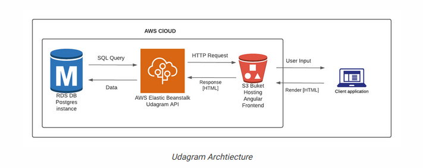

## Infrastructure

#### S3 Bucket

using AWS S3 Bucket for deploying The udagram-frontend application

URL: `my-udgram-bucket.s3-website-us-east-1.amazonaws.com`

#### Elastic Beanstalk

using AWS Elastic Beanstalk (eb) for deploying the udagram-api

URL: `http://my-udgram-api-dev.eba-gfhjdju8.us-east-1.elasticbeanstalk.com/api/v0`

#### RDS Postgres

using AWS RDS Postgres as a database

DB: `database-1.cxx8pogutrsl.us-east-1.rds.amazonaws.com`
