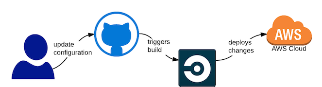

## Pipeline

connect github repo to circleci which detecting changes each time pushing to the main branch.

create `.circleci/config.yml` which will be readed by circleci and excute jobs

- 1st job udagram-frontend : build the frontend then deploy to s3 via AWS CLI.
- 2nd job udagram-backend :"build the backend then init the eb cli to deploy on created enviroment.
